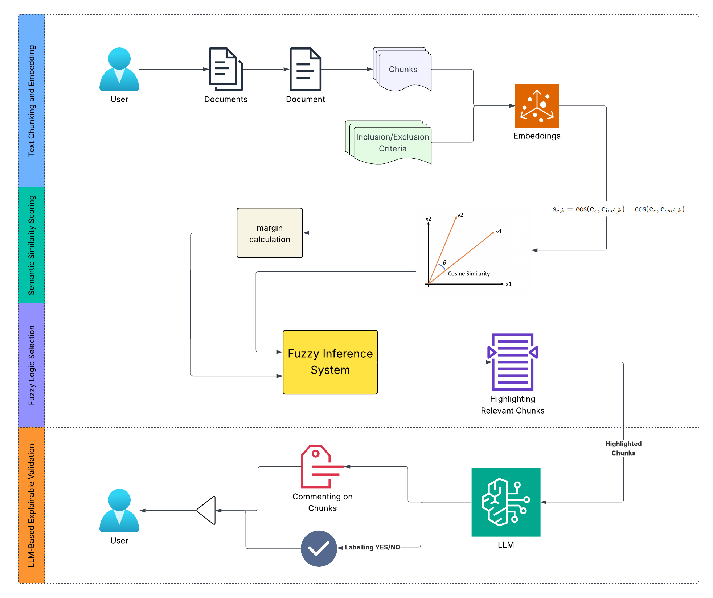
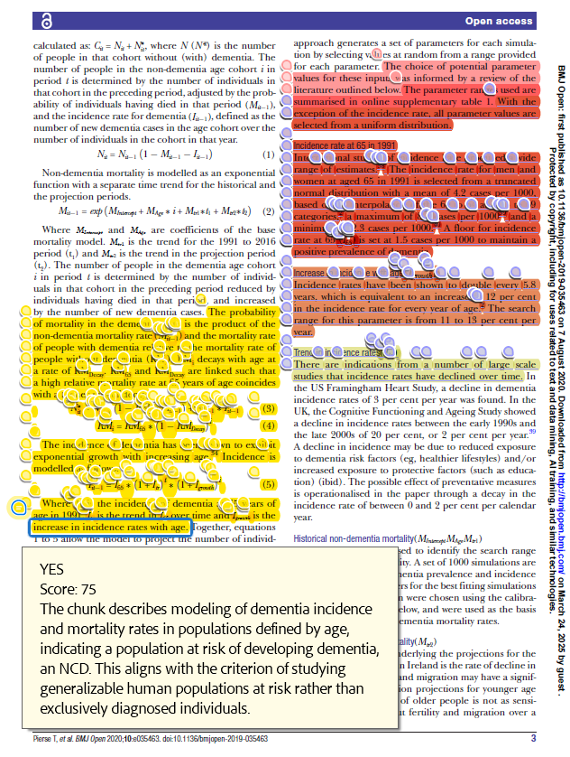

# 🧠 NLP Pipeline for Full-Text Screening Using LLMs and Embeddings

This repository implements a comprehensive pipeline to **automate the full-text screening** of scientific literature (PDF format). It integrates **OpenAI embeddings**, **LLM-based validation (GPT-4.1-mini)**, optional **BioBERT fine-tuning**, and **contrastive inclusion/exclusion scoring**. The pipeline outputs **annotated PDFs** with highlights, tooltips, and **compliance reports** for systematic review support.

---

## 📂 Repository Structure

```
.
├── main.py                       # Entry point for running the full pipeline
├── config.py                     # Inclusion/exclusion criteria, thresholds, colors, API keys
├── models/
│   └── biobert_trainer.py        # Optional: fine-tune BioBERT with labeled data
├── utils/
│   ├── check_chunk_llm.py        # Batch/single LLM verification of candidate chunks
│   ├── cost_tracker.py           # Tracks OpenAI API usage and cost with plots
│   ├── embedding.py              # Embedding functions with caching
│   ├── get_pdfs_from_zotero.py   # Utility to fetch papers from Zotero libraries
│   ├── pdf_highlighter.py        # Annotates PDFs with highlights and comments
│   ├── pdf_parser.py             # Extracts sentence-based text chunks from PDFs
│   ├── plotting.py               # Helper for compliance and result visualizations
│   └── similarity.py             # Cosine similarity + contrastive scoring (incl. exclusion)
├── notebooks/
│   └── compliant_files.ipynb     # Example analysis: compliance stats and evaluation
├── data/
│   ├── papers/                   # Input: drop PDFs here (or sync from Zotero)
│   ├── output/                   # Output: annotated PDFs and reports
│   └── excels/                   # Tabular compliance summaries
├── requirements.txt
├── LICENSE
└── .gitignore
```

---

## 🧠 What This Pipeline Does

### Problem
Systematic review full-text screening is manual, slow, and subjective. This project automates the semantic triage of PDFs using embeddings and LLM reasoning.

### Solution Workflow
1. 📄 Parse PDFs into overlapping sentence chunks.
2. 🔢 Embed each chunk with OpenAI `text-embedding-3-large`.
3. ⚖️ Score similarity against **both inclusion and exclusion criteria**.
4. ✅ Verify borderline/high-scoring chunks with GPT-4.1-mini (YES/NO/MAYBE + explanation).
5. 🖍️ Annotate PDFs with criterion-colored highlights and reasoning tooltips.
6. 📊 Generate compliance reports (Excel, plots, token/cost tracking).

---

## 🏗️ Pipeline Architecture

### Overview
1. PDFs → `data/papers/`
2. Sentence-based chunking (sliding windows)
3. Embedding generation + caching
4. Contrastive similarity scoring (inclusion vs. exclusion)
5. LLM batch verification (`check_chunk_llm.py`)
6. PDF annotation (`pdf_highlighter.py`)
7. Compliance stats & plots (`plotting.py`)
8. Annotated outputs → `data/output/`

### Diagram



---

## 🔍 Inclusion & Exclusion Criteria

Defined in `config.py`:

- **Inclusion Criteria**: e.g., Population, Intervention, Outcome, Study Design.
- **Exclusion Criteria**: e.g., overly clinical cohorts, observational-only studies, non-NCD focus, regression-only methods.
- Each criterion has:
  - Descriptive text
  - Label
  - Highlight color

---

## 🧪 How Matching Works

1. **Chunking**: `pdf_parser.py` uses PyMuPDF to create overlapping sentence windows.
2. **Embedding**: Chunks and criteria embedded via OpenAI API (`embedding.py`).
3. **Contrastive Scoring**: `similarity.py` compares chunk embeddings to **both inclusion and exclusion** vectors.
4. **LLM Verification**:  
   - `check_chunk_llm.py` uses GPT-4.1-mini (via LangChain).  
   - Assigns **YES/NO/MAYBE** with score + justification.  
   - Supports batch mode with concurrency control.
5. **Annotation**: `pdf_highlighter.py` highlights matched text in criterion colors and adds LLM explanations as tooltips.
6. **Reporting**: `plotting.py` + notebooks produce Excel compliance tables, summary plots, and cost tracking (`cost_tracker.py`).

---

## ⚙️ Configuration

Adjust in `config.py`:
- `INCLUSION_CRITERIA` / `EXCLUSION_CRITERIA`
- `SIMILARITY_THRESHOLD`
- `SENTENCES_PER_CHUNK`
- `CRITERIA_COLORS`
- `LLM_MODEL`, `EMBED_MODEL`
- Cost plot output folder

---

## 🚀 Getting Started

### Install
```bash
pip install -r requirements.txt
```

### API Key
Create `.env`:
```
OPENAI_API_KEY=your-key-here
```

### Run
```bash
python main.py
```

### Review Outputs
- Annotated PDFs → `data/output/`
- Compliance tables → `data/excels/`
- Cost plots → `plots/`



---

## 🔬 Optional: BioBERT Training

Fine-tune BioBERT with labeled inclusion/exclusion data:

```python
from models.biobert_trainer import train_biobert
train_biobert([
    {"text": "NCD simulation model using burden-of-disease", "label": 1},
    {"text": "Descriptive regression only", "label": 0},
])
```

---

## 📊 Additional Features
- Zotero integration (`get_pdfs_from_zotero.py`) for syncing papers.
- API cost tracking (`cost_tracker.py`) with usage plots.
- Compliance exploration notebooks (`notebooks/compliant_files.ipynb`).

---

## 💡 Use Cases
- Systematic reviews
- Automated triage of scientific PDFs
- Transparent inclusion/exclusion filtering
- NLP pipelines for health modeling and evidence synthesis

---

## 📜 License
MIT License.

---

## 🙏 Acknowledgments
- [OpenAI](https://openai.com/)  
- [LangChain](https://www.langchain.com/)  
- [HuggingFace](https://huggingface.co/)  
- [PyMuPDF](https://pymupdf.readthedocs.io/)  
